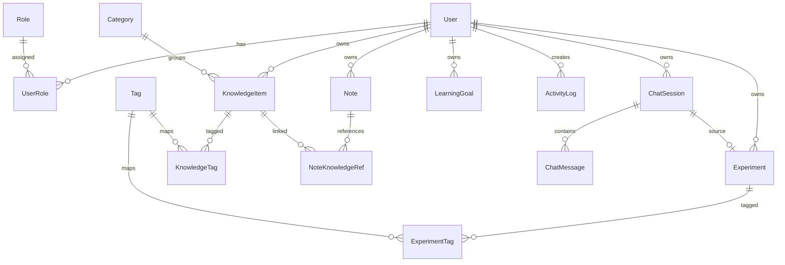

# AIdea · 数据模型设计

## 1. 文档目标

本文档定义 `AIdea` 首版核心实体、关系、字段建议和数据库设计原则，服务于 `Prisma schema`、后端模块开发与接口设计。

## 2. 设计原则

- 支持个人使用场景，同时预留多人扩展能力
- 实体关系清晰，优先满足 MVP
- 重要内容保留创建人、更新时间和归属信息
- 支持知识、笔记、实验、AI 对话之间的关联

## 3. 核心实体总览

- `User`
- `Role`
- `UserRole`
- `KnowledgeItem`
- `Category`
- `Tag`
- `KnowledgeTag`
- `Note`
- `NoteKnowledgeRef`
- `Experiment`
- `ExperimentTag`
- `ChatSession`
- `ChatMessage`
- `LearningGoal`
- `ActivityLog`
- `AiProviderConfig`
- `AiInvocationLog`

## 4. 实体定义

## 4.1 User

用途：系统用户主体。

建议字段：

- `id`
- `email`
- `passwordHash`
- `displayName`
- `avatarUrl`
- `status`
- `createdAt`
- `updatedAt`

说明：

- 首版支持本地账号密码登录
- 后续可扩展第三方登录字段

## 4.2 Role

用途：定义角色。

建议字段：

- `id`
- `code`
- `name`
- `description`

首版固定值：

- `admin`
- `member`

## 4.3 UserRole

用途：用户与角色多对多关系。

建议字段：

- `id`
- `userId`
- `roleId`
- `createdAt`

## 4.4 Category

用途：知识分类。

建议字段：

- `id`
- `name`
- `slug`
- `description`
- `ownerUserId`
- `createdAt`
- `updatedAt`

说明：

- 为多人场景保留 `ownerUserId`

## 4.5 Tag

用途：标签。

建议字段：

- `id`
- `name`
- `color`
- `ownerUserId`
- `createdAt`
- `updatedAt`

## 4.6 KnowledgeItem

用途：知识条目主体。

建议字段：

- `id`
- `title`
- `summary`
- `content`
- `sourceUrl`
- `sourceType`
- `categoryId`
- `ownerUserId`
- `visibility`
- `createdAt`
- `updatedAt`

说明：

- `visibility` 首版可支持 `private`、`team`
- `content` 首版可存 markdown 或富文本字符串

## 4.7 KnowledgeTag

用途：知识条目与标签多对多关系。

建议字段：

- `id`
- `knowledgeItemId`
- `tagId`

## 4.8 Note

用途：学习笔记。

建议字段：

- `id`
- `title`
- `content`
- `templateKey`
- `ownerUserId`
- `createdAt`
- `updatedAt`

说明：

- `templateKey` 用于对应前端配置化笔记模板

## 4.9 NoteKnowledgeRef

用途：笔记与知识条目的多对多关系。

建议字段：

- `id`
- `noteId`
- `knowledgeItemId`

## 4.10 Experiment

用途：AI 学习实验记录。

建议字段：

- `id`
- `title`
- `purpose`
- `prompt`
- `inputText`
- `outputText`
- `summary`
- `conclusion`
- `providerName`
- `modelName`
- `ownerUserId`
- `chatSessionId`
- `createdAt`
- `updatedAt`

说明：

- 可由 AI Chat 转存而来
- `chatSessionId` 可为空

## 4.11 ExperimentTag

用途：实验与标签多对多关系。

建议字段：

- `id`
- `experimentId`
- `tagId`

## 4.12 ChatSession

用途：AI 对话会话。

建议字段：

- `id`
- `title`
- `contextType`
- `contextRefId`
- `ownerUserId`
- `createdAt`
- `updatedAt`

说明：

- `contextType` 可取 `knowledge`、`note`、`free`
- `contextRefId` 指向具体上下文实体

## 4.13 ChatMessage

用途：对话消息明细。

建议字段：

- `id`
- `sessionId`
- `role`
- `content`
- `toolKey`
- `providerName`
- `modelName`
- `tokenUsage`
- `latencyMs`
- `createdAt`

说明：

- `role` 可取 `system`、`user`、`assistant`
- `toolKey` 可为空

## 4.14 LearningGoal

用途：学习目标与阶段跟踪。

建议字段：

- `id`
- `title`
- `description`
- `status`
- `startDate`
- `dueDate`
- `ownerUserId`
- `createdAt`
- `updatedAt`

## 4.15 ActivityLog

用途：关键行为日志，用于 Dashboard 聚合和审计辅助。

建议字段：

- `id`
- `userId`
- `actionType`
- `targetType`
- `targetId`
- `metadata`
- `createdAt`

## 4.16 AiProviderConfig

用途：模型提供方配置，包含加密存储的 API Key。

建议字段：

- `id`
- `ownerUserId`
- `providerName`（如 `openai`、`deepseek`、`anthropic`）
- `baseUrl`（可选，用于自定义接入地址）
- `modelList`（JSON 数组，存储该 Provider 支持的模型名列表）
- `defaultModel`（当前选用的默认模型名）
- `encryptedApiKey`（AES-256-GCM 加密后的 Base64 字符串）
- `apiKeyIv`（加密 IV，Base64，每次保存时重新生成）
- `apiKeyAuthTag`（GCM 认证标签，Base64，用于防篡改校验）
- `isEnabled`
- `createdAt`
- `updatedAt`

说明：

- API Key 由用户通过 Settings UI 配置，后端用 AES-256-GCM 加密后存入此表
- 解密密钥来自环境变量 `ENCRYPTION_KEY`，不存入数据库
- Settings UI **绝不回显明文 Key**，只展示"已配置 ✓"状态
- `modelList` 和 `defaultModel` 联合决定前端模型选择器的可选项与默认值

## 4.17 AiInvocationLog

用途：记录模型调用情况。

建议字段：

- `id`
- `userId`
- `providerName`
- `modelName`
- `toolKey`
- `requestSummary`
- `responseSummary`
- `status`
- `tokenUsage`
- `latencyMs`
- `createdAt`

## 5. 关系设计

## 6. 首版表设计建议

首版数据库应优先完成以下表：

- `users`
- `roles`
- `user_roles`
- `categories`
- `tags`
- `knowledge_items`
- `knowledge_tags`
- `notes`
- `note_knowledge_refs`
- `chat_sessions`
- `chat_messages`
- `experiments`
- `activity_logs`
- `ai_invocation_logs`

以下表可在第二阶段补充：

- `learning_goals`
- `experiment_tags`

说明：`ai_provider_configs` 已提升至首版必建表，原因是 AI Chat 功能强依赖 Provider 配置，Settings 页模型配置与 AI Chat 需同步交付。

## 7. 索引建议

- `users.email` 唯一索引
- `roles.code` 唯一索引
- `categories.slug` 唯一索引
- `tags.name + ownerUserId` 联合索引
- `knowledge_items.ownerUserId + createdAt` 联合索引
- `knowledge_items.categoryId` 索引
- `notes.ownerUserId + updatedAt` 联合索引
- `chat_messages.sessionId + createdAt` 联合索引
- `experiments.ownerUserId + createdAt` 联合索引
- `activity_logs.userId + createdAt` 联合索引
- `ai_invocation_logs.userId + createdAt` 联合索引

## 8. 枚举建议

### UserStatus

- `active`
- `disabled`

### Visibility

- `private`
- `team`

### ChatContextType

- `knowledge`
- `note`
- `free`

### ChatRole

- `system`
- `user`
- `assistant`

### GoalStatus

- `todo`
- `in_progress`
- `done`
- `archived`

## 9. 数据归属策略

为兼容未来多人系统，以下实体建议全部保留 `ownerUserId`：

- `Category`
- `Tag`
- `KnowledgeItem`
- `Note`
- `Experiment`
- `ChatSession`
- `LearningGoal`

这样首版即使主要为个人使用，也可以在权限控制上天然支持“按归属过滤”。

## 10. 与配置驱动的配合

数据模型中应保留与前端配置配合的关键字段：

- `Note.templateKey`：映射笔记模板
- `ChatMessage.toolKey`：映射 AI 工具注册表
- `KnowledgeItem.sourceType`：映射知识来源类型配置

## 11. 后续可扩展方向

- 增加分享页相关实体
- 增加协作成员关系
- 增加向量索引与文档切片表
- 增加文件附件表

## 12. Prisma 建模建议

建模顺序建议如下：

1. `User`、`Role`、`UserRole`
2. `Category`、`Tag`
3. `KnowledgeItem`、`KnowledgeTag`
4. `Note`、`NoteKnowledgeRef`
5. `ChatSession`、`ChatMessage`
6. `Experiment`
7. `ActivityLog`、`AiInvocationLog`

优先保证登录、知识条目、笔记、对话、实验 5 个主流程的实体完整闭环。
